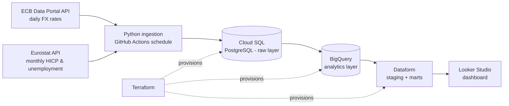

# EU Economic Data Platform

Automated data lake & reporting platform on GCP. Ingests official European
economic statistics from the **ECB Data Portal** (daily FX reference rates)
and **Eurostat** (monthly inflation and unemployment), lands them in
**Cloud SQL**, replicates to **BigQuery**, and models them with **Dataform**
into analysis-ready reporting tables. Infrastructure is managed with
**Terraform**; ingestion and deployments run on **GitHub Actions**.

## Architecture



## Data sources

| Source | Dataset | Cadence | Notes |
|---|---|---|---|
| ECB Data Portal | `EXR` — euro FX reference rates (USD, GBP, JPY, CHF) | Daily (TARGET business days) | SDMX-JSON, no auth |
| Eurostat | `prc_hicp_manr` — HICP inflation, annual rate of change | Monthly (~2 month lag) | JSON-stat 2.0, no auth |
| Eurostat | `une_rt_m` — unemployment rate, seasonally adjusted | Monthly (~2 month lag) | JSON-stat 2.0, no auth |

## Project layout

```
ingestion/        Python package: API clients + CLI entry point
terraform/        GCP infrastructure as code (Cloud SQL, BigQuery, IAM)
dataform/         SQLX models: staging views + reporting marts
.github/workflows GitHub Actions: CI, scheduled ingestion, terraform deploys
tests/            Unit tests for the ingestion parsers
```

## Local usage

```bash
pip install -r requirements.txt
python -m ingestion.main --source all --output data/
```

Writes tidy CSVs (one per dataset) to `data/` and prints a row-count summary.

## Roadmap

- [x] **Phase 0 — Extractors (local):** repo scaffold; ECB + Eurostat clients
  parsing SDMX-JSON / JSON-stat into tidy records; CLI writing CSVs.
- [ ] **Phase 1 — Landing zone (week 1):** Terraform foundation (GCS state
  bucket, Cloud SQL PostgreSQL, service accounts, least-privilege IAM);
  ingestion writes idempotent upserts to Cloud SQL with load metadata.
- [ ] **Phase 2 — Analytics layer (week 2):** BigQuery datasets + scheduled
  Cloud SQL → BigQuery sync (federated query); Dataform staging views and
  reporting marts (FX daily/monthly aggregates, inflation vs unemployment
  by country); assertions for data quality.
- [ ] **Phase 3 — Automation & polish (week 3):** GitHub Actions CI (lint,
  tests, terraform plan on PR), scheduled daily ingestion workflow with
  Workload Identity Federation (no long-lived keys), Looker Studio dashboard,
  architecture docs.
